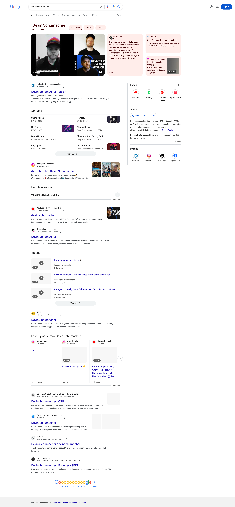

# How to optimize your online presence to look more legitimate and reach more listeners

> WIP: work in progress

When someone searches your artist name online, what comes up?

When I searched my friend "That's Nice" - a music producer who has written songs with well known artists like Josh Moriarty and Miami Horror, the search engines looked like he didnt exist.

Here's a screenshot:

But when I googled myself - a "music producer" who has written songs with no well known artists, it looks like this:

You've spent alot of effort building talent & reptuation in the real world, but that doesn't mean it automatically translates to the digital world.

We can help.