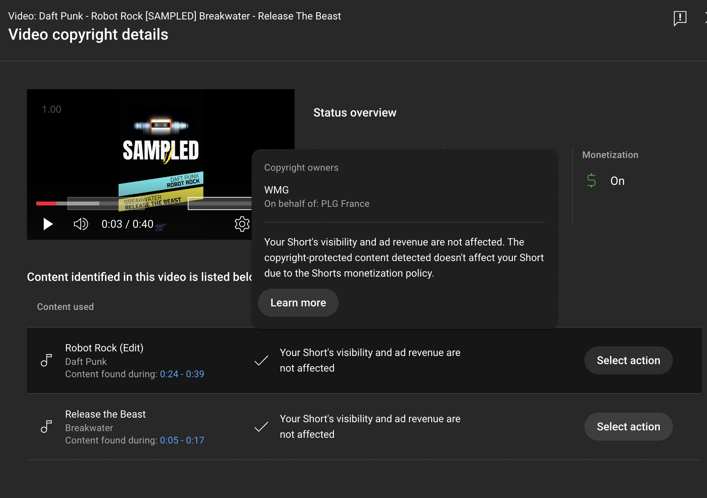
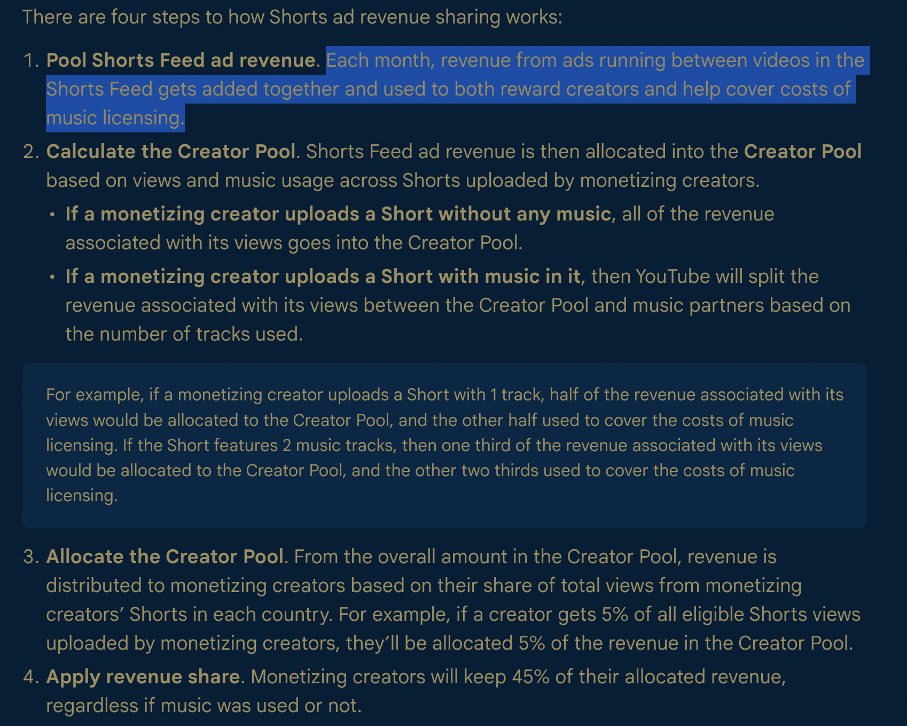

# How to make more money from your music by collaborating through YouTube shorts

Monetizing partners can earn money from ads that are viewed between videos in the Shorts Feed.

What's this mean?

It means that if we create short form content, and put your music in it, you get paid - copyright or not.

For example - here's a short I made with Daft Punk song in it:

Normally that would be ineligible, however because of the short's policy the creator gets paid.

So leverage our AI tools to create more content, and our audience to get more views to the videos, and get paid for it.

